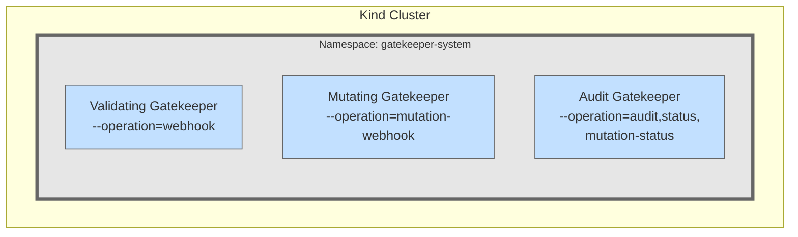
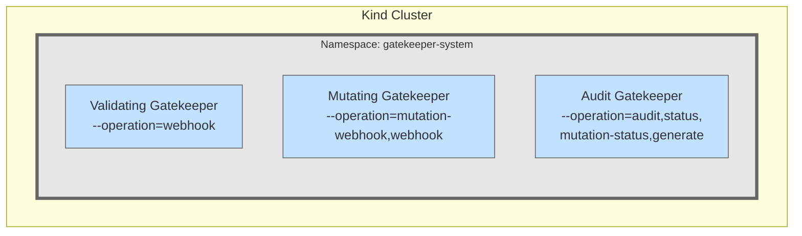

# Getting Started

This playground provides a complete environment to reproduce [Gatekeeper issue #3928](https://github.com/open-policy-agent/gatekeeper/issues/3928) with OPA Gatekeeper in a Kubernetes cluster using Kind.

## What You Can Do

- Recreate [Gatekeeper issue #3928](https://github.com/open-policy-agent/gatekeeper/issues/3928)
- Launch separate playgrounds with either a 1.29.12 or 1.32.3 Kind cluster
- Deploy Gatekeeper 3.15.1 (no defect)
- Or deploy Gatekeeper 3.18.3 (defect)
- Apply policy enforcement resources
- Test policy enforcement with the sample resources

## Deploying Kind 1.29.12 and Gatekeeper 3.15.1



## Observations
No defect observed for Gatkeeper 3.15:
* Support running seprate operations for each webhook, one for validating and one for mutation.
* **Does not** have an `operation=generate` for the audit webhook.
* All mutation and validation policies work as expected.

### Running the Playground

1. Open the [playground](https://labs.iximiuz.com/playgrounds/my-custom-e733aca2-1848dc81) in a separate browser tab
2. Start playground with `kind.version` set to `1.29.12` under the Playground Parameters section above.
3. Once the playground fully starts, you control the deployment of the Gatekeeper environement by using `make` targets under the home directory of the playground.

### Running Make Targets

Ensure you are in the home directory of the playground and run the following make targets in this order:

1. Deploy Gatekeeper version 3.15.1.
   ```shell
   make deploy-gk-3-15-1
   ```
2. Apply all Gatekeeper policies (mutation and validation).
   ```shell
   make apply-policy
   ```
3. Apply all example resources.
   ```shell
   make apply-example-resources
   ```
4. Review the running gatekeeper instances and their configured operations. 
   * The gatekeeper mutation webhook is configured with only `mutation-webhook` operation.
   * The gatekeeper validating webhook is configured with only `webhook` operation.
   * The gatekeeper audit webhook is configured with `audit, status, mutation-status` operations.

## Deploying Kind 1.32.3 and Gatekeeper 3.18.3



## Observations
Defect observed for Gatekeeper 3.18
* **Cannot** run seprate operations for each webhook, one for validating and one for mutation. 
  * As a potential workaround: Add the `webhook` operation to the mutation gatekeeper webhook in addition to the `mutation-webhook` operation.
* The audit gatekeeper webhook MUST add the `generate` operation.
* All mutation and valdation policies seem to work as expected.

### Running the Playground

1. Open the [playground](https://labs.iximiuz.com/playgrounds/my-custom-e733aca2-1848dc81) in a separate browser tab
2. Start the playground with `kind.version` set to `1.32.3` under the Playground Parameters section above.
3. Once the playground fully starts, you control the deployment of the Gatekeeper environement by using `make` targets under the home directory of the playground.

### Running Make Targets

Ensure you are in the home directory of the playground and run the following make targets in this order:

1. Deploy Gatekeeper version 3.18.3:
   ```shell
   make deploy-gk-3-18-3
   ```
   * The gatekeeper-mutating-controller-manager will fail to start due to [Gatekeeper issue #3928](https://github.com/open-policy-agent/gatekeeper/issues/3928).
   * A potential workaround is to add the `operation=webhook` to the gatekeeper-mutating-controller-manager deployment manifest.
   * Update the deployment manifest by running the following command:
    ```shell  
    sed -i '/- --operation=mutation-webhook/ a\        - --operation=webhook' deployment/mutating-gatekeeper-3-18-3.yaml
    ```
   * Re-run the `make deploy-gk-3-18-3` target command
      
2. Apply all Gatekeeper policies (mutation and validation):
   ```shell
   make apply-policy
   ```
3. Apply all example resources:
   ```shell
   make apply-example-resources
   ```
4. Review the running gatekeeper instances and their configured operations. 
   * The gatekeeper mutation webhook is **configured with the potential workaround** of `mutation-webhook` and `webhook` operations.
   * The gatekeeper validating webhook is configured with only `webhook` operation.
   * The gatekeeper audit webhook is configured with `audit, status, mutation-status, generate` operations.
